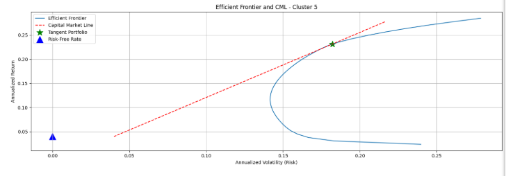
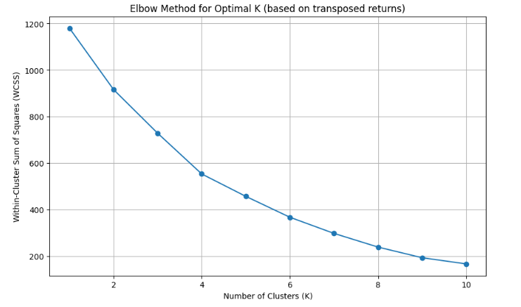
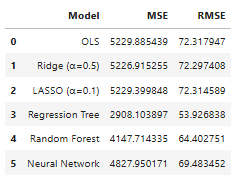
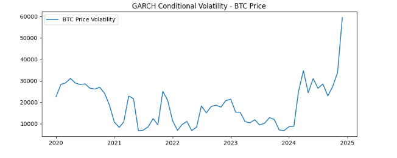

# FinTech Data Analytics, Machine Learning & Time Series (Python)

## Overview
This project demonstrates an end-to-end analytics workflow using financial and macroeconomic datasets:
data preparation, regression and machine learning modelling, unsupervised learning with portfolio
construction, and time-series forecasting/volatility modelling.

## What’s inside
1. **Data Preparation:** Cleaning, reshaping, and merging datasets (WDI, IMF, COVID).
2. **Predictive Modelling:** Regression baselines + machine learning models and evaluation (e.g., RMSE/MSE).
3. **Unsupervised Learning + Portfolio:** K-means clustering of stock returns and portfolio optimisation / efficient frontier.
4. **Time Series Forecasting:** VAR modelling with train/test evaluation.
5. **Volatility Modelling:** ARCH/GARCH modelling on crypto returns and conditional volatility analysis.

## Tools
- Python: pandas, numpy, sklearn, statsmodels
- Finance/time series: yfinance, arch
- Visualisation: matplotlib

## Key outputs

### Efficient frontier and capital market line

### K-means clustering (elbow method)

### Machine learning model performance comparison

### GARCH conditional volatility (cryptocurrency)

## How to run
Open the notebook in `/notebooks` and run cells top-to-bottom.

## Author
Nimra Khan

